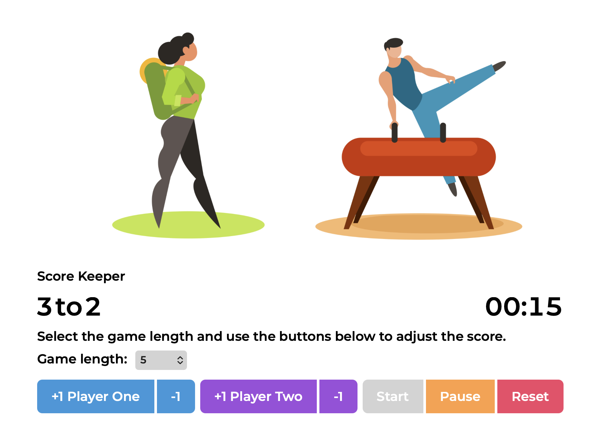

# Score Keeper

A lightweight **responsive web app** for tracking scores between two players during a match or practice session. Built using **HTML, CSS and vanilla JavaScript**, with focus on simplicity, clarity and smooth interaction.

## Description
This is a personal project created to practice JavaScript state management, DOM manipulation and responsive UI design without using external frameworks.

The app includes:
- Configurable winning score
- Live match timer
- Start, Pause and Reset controls
- Buttons for adding or subtracting points
- Automatic end-of-game detection
- Visual indication of the winner

Hero images sourced from Unsplash, created by [Public domain vectors](https://unsplash.com/@publicdomainvectors).

## Preview

